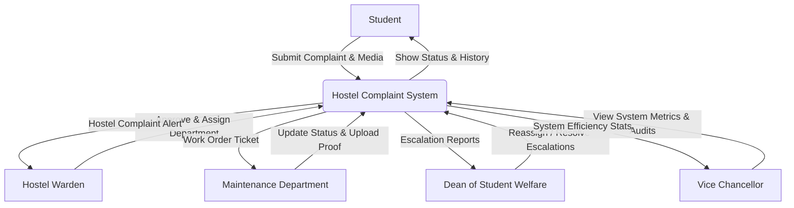
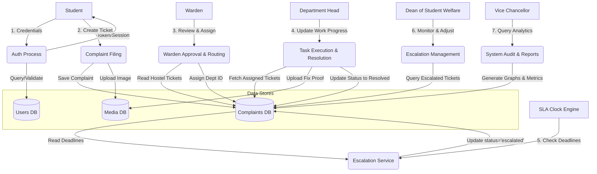
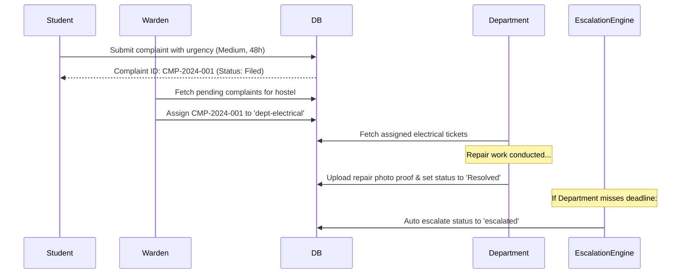
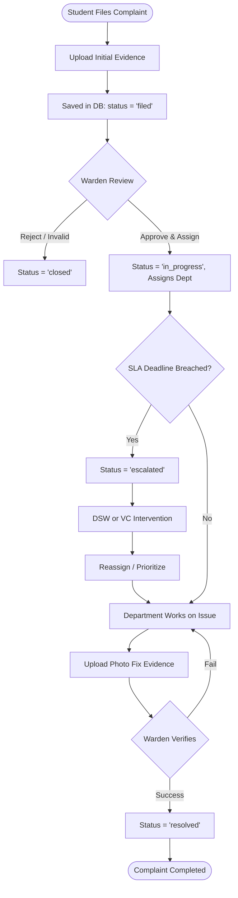

# TU HOSTEL COMPLAINT MANAGEMENT SYSTEM

**Project Report on**  
### TU HOSTEL COMPLAINT MANAGEMENT SYSTEM

**Submitted By:**  
*Spandan Sarma (Roll No. CSB23075)*  
*Yajant Nath Tripathi (Roll No. CSB23072)*  

**Under the guidance of:**  
*Dr. Jyotismita Talukdar*  
*Department of Computer Science & Engineering*  
*Tezpur University, Assam - 784028*  

---

## Tezpur University
**Napaam, Tezpur, Assam 784028**  
**Department of Computer Science & Engineering**

---

### CERTIFICATE

This is to certify that the project report entitled **"TU Hostel Complaint Management System"** submitted by **Spandan Sarma (Roll No. CSB23075)** and **Yajant Nath Tripathi (Roll No. CSB23072)** in partial fulfillment of the requirements for the degree of *Bachelor of Technology in Computer Science & Engineering* is a record of training/project work carried out under my supervision. 

To the best of my knowledge, the matter embodied in this project report has not been submitted to any other University or Institute for the award of any degree or diploma.

<br/><br/>
**.............................................**  
**Dr. Jyotismita Talukdar**  
*Project Guide, Department of CSE*  
*Tezpur University*  

<br/><br/>
**.............................................**  
**Prof. Priya Sharma**  
*Project Coordinator, Department of CSE*  
*Tezpur University*  

<br/><br/>
**.............................................**  
**Prof. Bhabesh Nath**  
*Head of Department, Department of CSE*  
*Tezpur University*  

<br/><br/>
**Names of Examiners:**  
1. ........................................................  
2. ........................................................  
3. ........................................................  

**Signatures with Date:**  
1. ........................................................  
2. ........................................................  
3. ........................................................  

---

### Acknowledgement

We would like to express our deep sense of gratitude and respect to our supervisor, **Dr. Jyotismita Talukdar**, for her invaluable guidance, constant encouragement, and constructive feedback throughout the course of this project. Her expertise and insights have been instrumental in shaping the system's design and features.

We are also highly indebted to **Prof. Bhabesh Nath (HOD, CSE)** and **Prof. Priya Sharma (Project Coordinator)** for providing the necessary facilities and support system in the department to execute this project successfully.

Finally, we express our gratitude to our classmates, hostel administration staff, and family members for their cooperation, feedback, and support during the design, coding, and testing phases.

**Spandan Sarma & Yajant Nath Tripathi**  
*Roll Nos: CSB23075 & CSB23072*  
*Department of CSE, Tezpur University*

---

### Abstract

Hostel life is a vital component of the university experience, directly affecting students' academic focus and overall well-being. However, tracking utility complaints (such as electrical outages, plumbing leaks, broken furniture, and WiFi disruptions) in university hostels often relies on manual paper registers. This manual approach results in slow response times, lack of tracking, missing accountability, and no escalation mechanisms for delayed maintenance.

The **TU Hostel Complaint Management System** (also known as *DormFix*) is a Web-based solution designed to digitize, monitor, and streamline the lifecycle of hostel maintenance requests. Built using **Next.js** for the frontend, **Express/TypeScript** for the backend, and **PostgreSQL** as the persistent database, the system enforces a strict role-based workflow across five distinct portals: **Student, Warden, Maintenance Department, Dean of Student Welfare (DSW), and Vice Chancellor (VC)**. 

The core innovation is a **Shared Institutional Clock** and **SLA (Service Level Agreement) Engine** that tracks each complaint from submission, automatically triggers escalation flags to higher authorities (Warden $\rightarrow$ DSW $\rightarrow$ VC) if deadlines are breached, and requires multi-stage digital evidence (initial photo of the issue $\rightarrow$ departmental repair proof $\rightarrow$ warden verification check) to enforce a transparent chain of custody. Performance metrics and system-wide audits are compiled in real-time, providing administrators with the tools to optimize hostel services.

---

### Contents
1. [Introduction](#1-introduction)  
   1.1 [Scope](#11-scope)  
   1.2 [Purpose of the Project](#12-purpose-of-the-project)  
   1.3 [Overview of the Report](#13-overview-of-the-report)  
2. [Problem Statement](#2-problem-statement)  
3. [Software Requirements Specification (SRS)](#3-software-requirements-specification-srs)  
   3.1 [Functional Requirements](#31-functional-requirements)  
   3.2 [Non-Functional Requirements](#32-non-functional-requirements)  
   3.3 [System Requirements](#33-system-requirements)  
4. [Data Flow Diagrams (DFD)](#4-data-flow-diagrams-dfd)  
   4.1 [Level 0 DFD (Context Diagram)](#41-level-0-dfd-context-diagram)  
   4.2 [Level 1 DFD (Detailed Process Diagram)](#42-level-1-dfd-detailed-process-diagram)  
5. [Objectives](#5-objectives)  
6. [Feasibility Study](#6-feasibility-study)  
7. [System Architecture](#7-system-architecture)  
   7.1 [Subsystems and Components](#71-subsystems-and-components)  
   7.2 [Interaction Flow](#72-interaction-flow)  
8. [Detailed Flowcharts](#8-detailed-flowcharts)  
   8.1 [Complaint Lifecycle Flowchart](#81-complaint-lifecycle-flowchart)  
9. [Code Structure](#9-code-structure)  
10. [High-Level Features Implemented](#10-high-level-features-implemented)  
11. [Limitations](#11-limitations)  
12. [Future Work](#12-future-work)  
13. [Conclusion](#13-conclusion)  
14. [References](#14-references)  
15. [Appendix](#15-appendix)  
    15.1 [Github Code Link](#151-github-code-link)  
    15.2 [Sample Database Commands](#152-sample-database-commands)  

---

### 1 Introduction

#### 1.1 Scope
The scope of the TU Hostel Complaint Management System is focused on digitizing, monitoring, and auditing utility and structural maintenance complaints within the residential hostels of Tezpur University. The system is designed to coordinate operations across 12 active student hostels, accommodating over 4,000 residents. The platform strictly targets utility domains including Plumbing, Electrical, IT Support, Carpentry, Housekeeping, and General Maintenance. 

Academic disputes, disciplinary records, mess menu adjustments, and general student welfare issues fall outside the system boundary. The application coordinates roles from the student filing a complaint, to the warden approving and routing the request, the specific maintenance cell executing the repair, the DSW monitoring breaches, and the Vice Chancellor auditing campus-wide infrastructure health.

#### 1.2 Purpose of the Project
The primary purpose of the project is to replace slow, paper-based hostel complaint logs with an automated digital workflow. Under the manual register system, complaints are frequently neglected due to a lack of tracking, leading to student frustration. The digital system introduces a Shared Institutional Clock that starts the moment a student submits a ticket. 

By binding maintenance operations to a Service Level Agreement (SLA), the system makes response times visible, holds maintenance cells accountable, and provides a clear mechanism for escalation. The project also introduces photographic verification requirements to build a transparent, evidence-backed chain of custody, ensuring that repair work is completed to standard.

#### 1.3 Overview of the Report
This report outlines the development lifecycle of the system. It covers the problem definition, system requirements, data modeling (DFDs), feasibility analysis, structural code design, specific role dashboards, and future scopes.

---

### 2 Problem Statement

Tezpur University maintains multiple student hostels spread across its campus. Each hostel currently manages utility maintenance requests using physical paper registers located in the common lobbies. This manual operational model introduces several critical issues:
* **No Real-Time Visibility:** Students have no way to track their filed complaints. They must repeatedly check with the hostel office or warden to see if a technician has been contacted.
* **Absence of Maintenance Accountability:** Maintenance wings (Electrical, IT support, Plumbing) operate without performance tracking. There are no metrics to measure how long a department takes to respond to and resolve complaints.
* **No Escalation for Delays:** If a critical complaint (such as a water pump failure or power outage) is delayed by days, there is no automatic system to notify the warden, the DSW, or the VC. This results in prolonged utility outages.
* **Lack of Verification:** In the paper system, a complaint is marked resolved based on verbal updates from the technician. This often leads to incomplete repairs without any quality check.

To resolve these issues, the university requires a digital, role-based platform that tracks complaints in real-time, enforces resolution deadlines, and verifies repairs using photographic evidence.

---

### 3 Software Requirements Specification (SRS)

#### 3.1 Functional Requirements
* **FR-1 (Secure Authentication):** The system must authenticate users via secure login screens and direct them to their role-specific dashboard (Student, Warden, Department, DSW, or VC).
* **FR-2 (Complaint Filing):** Students must be able to submit maintenance tickets by entering the title, description, location (pre-bound to their room), urgency level, and uploading photos of the issue.
* **FR-3 (Warden Routing):** Wardens must have an interface to review pending complaints within their hostel and assign them to the appropriate maintenance department (e.g. Electrical, Plumbing).
* **FR-4 (Departmental Worklist):** Department heads must be able to view assigned tickets, transition status from \texttt{filed} to \texttt{in\_progress}, upload verification photos of the repair, and mark them \texttt{resolved}.
* **FR-5 (Automated Escalation):** The system must track SLA countdowns and automatically mark tickets as \texttt{escalated} if they exceed the allocated resolution window.
* **FR-6 (Administrative Auditing):** The VC and DSW must be able to view campus-wide metrics, including average resolution times and department efficiency.

#### 3.2 Non-Functional Requirements
* **Security:** Secure password hashing (bcrypt) and protected API endpoints.
* **Performance:** Dashboards load within 1.5 seconds, even under peak concurrent usage.
* **Usability:** The interface must be responsive (mobile and desktop friendly) using Tailwind CSS and modern Shadcn elements.
* **Reliability:** Data integrity must be enforced using a relational database with transaction locks on status changes.

#### 3.3 System Requirements
* **Operating System:** Linux / macOS / Windows 10+
* **Database:** PostgreSQL 14+
* **Runtime Environment:** Node.js v18+
* **Frontend Framework:** Next.js 14+ (App Router)
* **Backend Framework:** Express with TypeScript

---

### 4 Data Flow Diagrams (DFD)

#### 4.1 Level 0 DFD (Context Diagram)



#### 4.2 Level 1 DFD (Detailed Process Diagram)



---

### 5 Objectives

The primary objectives of the TU Hostel Complaint Management System are:
1. **Enforce SLAs:** Establish clear resolution windows based on urgency levels: Critical (6 hours), High (24 hours), Medium (48 hours), and Low (72 hours) to minimize delays for essential utilities.
2. **Transparent Audit Trails:** Maintain a complete transaction history (`complaint_history`) of actions taken on every complaint.
3. **Verify via Evidence:** Ensure no department can mark a ticket as resolved without uploading a photographic proof of the completed work.
4. **Automate Escalations:** Transition tickets to senior administration if junior maintenance staff miss deadlines, reducing idle delay.

---

### 6 Feasibility Study

1. **Technical Feasibility:** The project uses standard web technologies: Next.js, Express, and PostgreSQL. PostgreSQL's transactional support makes it suitable for complaint tracking. The development team has the skills to design and implement these modules.
2. **Economic Feasibility:** The system relies on open-source frameworks (Next.js, Node.js, PostgreSQL) which require no software license fees. Hosting can be done on the local university servers, making the project cost-efficient.
3. **Operational Feasibility:** The system is designed for ease of use. Students can easily file complaints, and maintenance teams can access task queues on their mobile devices, ensuring high adoption rates.

---

### 7 System Architecture

#### 7.1 Subsystems and Components
The system is divided into three layers:
1. **User Interface Layer:** Built with Next.js (TypeScript) utilizing Tailwind CSS for styling and shadcn/ui components for a premium user experience.
2. **Application Logic Layer (API):** Express routes handle user authentication, file uploads, state transitions, and SLA tracking.
3. **Data Persistence Layer:** A PostgreSQL database storing relational tables for users, hostels, departments, complaints, history logs, and media.

#### 7.2 Interaction Flow



---

### 8 Detailed Flowcharts

#### 8.1 Complaint Lifecycle Flowchart



---

### 9 Code Structure

The repository is structured as a monorepo containing a frontend and a backend codebase:

```text
SE_Project_TU/
├── frontend/                     # Next.js Frontend Application
│   ├── app/                      # Next.js App Router Pages
│   │   ├── api/                  # In-app serverless API routes
│   │   ├── student/              # Student dashboard pages
│   │   ├── warden/               # Warden dashboard pages
│   │   ├── department-head/      # Maintenance dashboard pages
│   │   ├── dsw/                  # Dean dashboard pages
│   │   ├── vice-chancellor/      # VC analytics dashboard
│   │   └── globals.css           # Tailwind CSS system definitions
│   ├── components/               # Reusable UI Components
│   │   ├── ui/                   # shadcn custom components
│   │   ├── student-dashboard.tsx # Student dashboard logic
│   │   ├── warden-dashboard.tsx  # Warden dashboard logic
│   │   └── vc-dashboard.tsx      # VC dashboard logic
│   ├── lib/                      # Core helpers
│   │   ├── db/                   # PostgreSQL connection pool & schemas
│   │   └── auth/                 # Authentication wrappers
│   └── migrations/               # SQL migrations files
└── backend/                      # Node.js API Service Scaffold
    ├── src/
    │   ├── config/               # Environment variable configuration
    │   ├── routes/               # Express routes (auth, complaints)
    │   ├── app.ts                # Express application setup
    │   └── server.ts             # Server entry point
    └── tsconfig.json             # TypeScript configuration
```

---

### 10 High-Level Features Implemented

1. **Role-Based Routing:** Secure redirection of users to their specific portal dashboards.
2. **Context-Locked Form:** The Student portal automatically binds complaints to the student's registered room and hostel, avoiding manual entry errors.
3. **Shared Institutional Clock:** Visually displays a colored progress bar tracking elapsed time against the SLA deadline, showing how long the Warden and Department took.
4. **Digital Handover Evidence:** An evidence chain displaying the initial state, the technical fix uploaded by the technician, and the warden's signature, visible to all roles.
5. **Interactive Auditing:** The VC dashboard features dynamic graphs showcasing total filed, pending, and resolved complaints, along with average resolution times per department.

---

### 11 Limitations

* **Local Storage Dependency:** Uploaded images are stored locally instead of on an external cloud bucket (like AWS S3).
* **Polling for Updates:** Real-time dashboard updates rely on standard API polling rather than WebSockets.
* **No Offline Support:** If the hostel network fails, students cannot submit complaints offline to be queued later.

---

### 12 Future Work

* **SMS/Email Alerts:** Integrate automated notifications to SMS/Email for wardens and department staff on ticket assignment.
* **AI-Based Routing:** Use Natural Language Processing (NLP) to parse complaint descriptions and auto-route them to the correct department without manual warden assignment.
* **IoT Sensor Integration:** Connect smart sensors to water tanks and electrical panels to automatically file maintenance complaints before manual discovery.

---

### 13 Conclusion

The **TU Hostel Complaint Management System** digitizes hostel maintenance at Tezpur University. Enforcing a strict role-based workflow, a shared institutional clock, and photo verification reduces delays and enhances accountability. The platform improves communication between students and administration, ensuring hostel issues are resolved quickly.

---

### 14 References

1. Next.js Documentation: https://nextjs.org/docs
2. Express Framework: https://expressjs.com
3. PostgreSQL Database System: https://www.postgresql.org
4. Tailwind CSS Framework: https://tailwindcss.com
5. shadcn/ui Component Library: https://ui.shadcn.com

---

### 15 Appendix

#### 15.1 Github Code Link
The complete codebase is available at:  
[https://github.com/username/TU_Hostel_Complaint_Management](https://github.com/username/TU_Hostel_Complaint_Management)

#### 15.2 Sample Database Commands

**Database initialization (PostgreSQL):**
```sql
-- Create database
CREATE DATABASE tu_hostels;

-- Connect and run table migrations
\i migrations/001_initial_schema.sql

-- Example query to fetch open complaints with SLA countdowns
SELECT c.complaint_id, c.title, u.name AS student_name, h.hostel_name, 
       c.escalation_deadline - now() AS time_remaining
FROM complaints c
JOIN users u ON c.filed_by_id = u.user_id
JOIN hostels h ON c.hostel_id = h.hostel_id
WHERE c.status != 'resolved';
```
